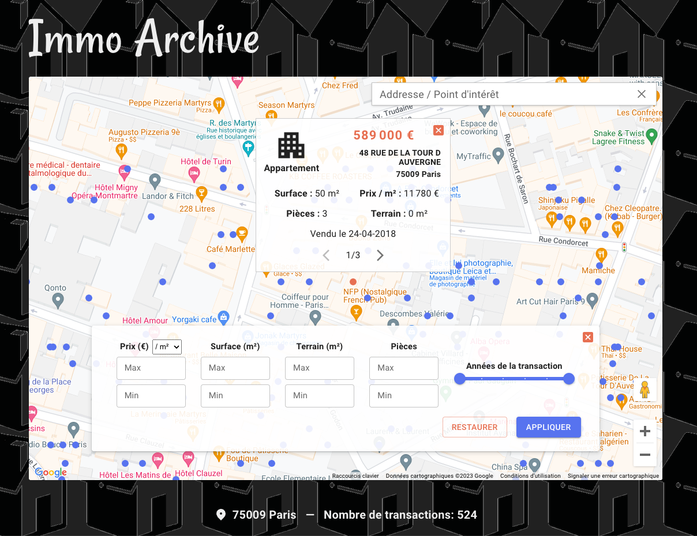

# ImmoArchive

Réutilisation de la base de données "DVF" rendant accessibles les valeurs foncières déclarées à l’occasion des transactions immobilières ([Demandes de Valeurs Foncières](https://www.data.gouv.fr/fr/datasets/demandes-de-valeurs-foncieres/)), plus particulièrement son jeu de données dérivé [Demandes de valeurs foncières géolocalisées](https://www.data.gouv.fr/fr/datasets/demandes-de-valeurs-foncieres-geolocalisees/) comportant en plus une géolocalisation.

## Stack

**FRONT** : Typescript, React, Next, Google Maps Platform, react-google-maps/API, Material UI, recharts, Cypress

**BACK** : Typescript, Google Cloud Platform (Cloud functions, Big Query), AWS (RDS for MySQL)

## Objectifs

**Permettre l'étude des transactions immobilières résidentielles par zone géographique, grâce à une carte, des filtres et de la visualisation de données.**

## Implémentation - Backend

### Formatage des données

Le fichier de valeurs foncières ([notice descriptive](./notice-descriptive-du-fichier-dvf-20210809.pdf)) se présente comme un registre de tous les biens immobiliers ayant été cédés de 2018 à 2021, ainsi qu'une partie de 2017 et 2022. Le fichier ne comporte pas les cessions ayant eu lieu en Haut-Rhin, Bas-Rhin, Moselle et à Mayotte.

Le formatage des données a consisté :

1. A isoler les biens cédés à l'occasion de ventes (vs donation, adjudication, etc...) ne comportant que des locaux à usage d'habitation (vs local commercial), situés au même emplacement géographique.
2. Lorsqu'une même vente comportait plusieurs locaux, à fusionner certaines valeurs entre elles.

[Voir la création de la base de données](./back/create-database.txt)

### Requête des données

Les requêtes des transactions immobilières se font toujours via les coordonnées géographiques correspondant aux bordures de la carte. D'autres filtres peuvent être ajoutés.

Les ID des transactions correspondant aux requêtes sont d'abord obtenues via BigQuery, où la base de données comporte un cluster par coordonnées géographiques. BigQuery permet de maintenir une bonne performance malgré des requêtes intensives. Toutefois, seules les IDs sont récupérées à ce stade, afin de se maintenir dans le free tiers en ne requêtant qu'une seule colonne.

Le reste des informations relatives aux transactions (prix, surface, etc...) est ensuite récupéré via une requête par ID sur un server MySql comportant également la base de données.

### Requête de l'API

Une cloud function reçoit les requêtes du frontend, requête BigQuery, requête le server MySql, formate et retourne les données pour leur utilisation sur le frontend

## Implémentation frontend

### La carte

Elle est le point d'entrée de l'application. Les utilisateurs peuvent scroller la carte ou utiliser la barre de recherche pour rechercher des biens qui ont été vendus.

Pour des raisons de performance du frontend et de limitation des requêtes trop intensives :

-   un zoom minimal a été ajouté
-   au-dessus d'un nombre de résultats (750 sur desktop, 400 sur mobile), l'utilisateur est invité à zoomer ou à filtrer davatantage

### Filtres

La carte permet de filtrer par :

-   prix
-   prix au metre carré
-   surface
-   nombre de pièces
-   surface du terrain (ou jardin)
-   année de la transaction

A chaque requête, les filtres appliqués sont affichés à l'utilisateur.

A chaque requête, les filtres appliqués ainsi que les coordonnées des bordures de la carte sont ajoutés à l'url afin de pouvoir enregistrer l'adresse de la recherche et y revenir.

### Graphiques

Six graphiques permettent d'analyser les résultats à chaque requête, avec une limitation de 1500 transactions, au-delà duquel l'utilisateur doit zoomer ou filtrer davantage pour visualiser les graphiques.

Quatre histogrammes (prix au mètre carré, valeur foncière, surface, nombre de pièces) permettent d'apprécier la typologie des transactions.

Un diagramme de dispersion ("scatter chart") permet d'analyser les prix par rapport aux surfaces et d'identifier les transactions en les pointant sur la carte.

Une courbe représente l'évolution du prix moyen au mètre carré sur six années.

### Tableau

Un tableau affiche toutes les transactions de la carte et permet de trier les transactions selon les mêmes critères que ceux disponibles pour le filtre.

Cliquer sur une ligne permet de pointer vers la transaction sur la carte.

## Deploiement

Le frontend est déployé sur Netlify et la fonction serverless sur google cloud.

## Principaux tests (frontend)

La totalité des tests a été effectuée via cypress.

**Unit testing**: les composants ont été testés sur leur changement d'apparence en cas de variation du nombre de résultats.
Les formulaires ont été testés de manière approfondie

**E2E**: des requêtes ont été simulées dans des villes aléatoires afin de vérifier que chaque composant affiche les bons éléments (filtres actifs, graphiques, markers, etc...). L'intéraction des composants entre eux a également été testée (ex: pointer une transaction sur la carte depuis le tableau)

## Auteur

Léo Terrier

## Info

[« DVF ou les données immobilières à portée de clics », Caroline THEUIL](https://www.journaldelagence.com/1273082-dvf-ou-les-donnees-immobilieres-a-portee-de-clics-caroline-theuil).
